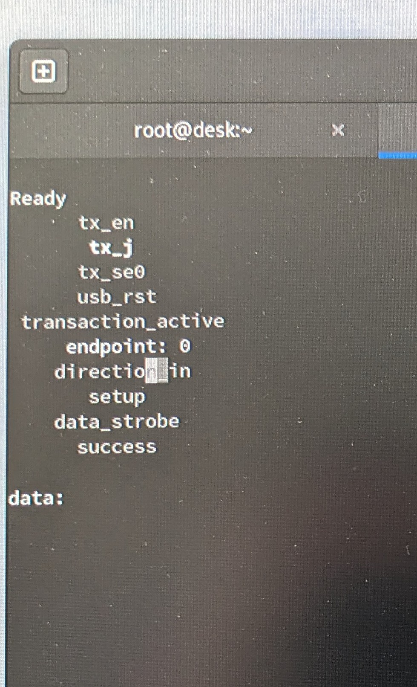
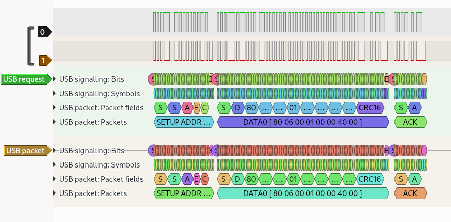

# usbTim
This is just a base implementation for a USB peripheral. I am increasingly needing more speed than I can get from asynchronous serial (UART). This is mostly derived from avakar/usbcorev. I'm currently working with an Orangecrab. I am anticipating more part shortages so I am reluctant to get in bed with say Xilinx (vis-a-vis proprietary IP) as China implodes.

I am also doing a silly experiment. Since the open source tools are so fast, I am experimenting with skipping simulation (gasp!!!) and doing my "simulation" in HW with a logic analyzer.
 

# Terminal output from FPGA
  This is an annunciator for various ports on the USB module. Bright text means a wire is active, dim means inactive, there is also some hex data too.  

USB on the wire

## Credits
- All the UART code comes from Russell Merrick's outstanding work over at (https://nandland.com/).
- The foundation USB code comes from Martin Vejnár's (https://github.com/avakar/usbcorev), I have merely chosen a unique way to learn how to expand on it.
